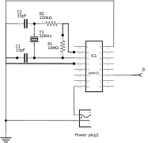
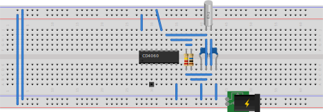

# CD4060 timer

The timer of an Arduino UNO is not that precise. Although it uses a Quartz Crystal, the crystal runs at 16MHz, so a slight deviation is pretty fast a large deviation in seconds per month.

An optimalization is the use of a Watch Crystal, A.K.A. as a 32kHz crystal. With the same "quality" in deviation, because of the frequency is a lot less, this will be pretty acurate.

Off course, we could also use a "real" RTC (Real-Time-Clock) circuit (based on a DS3231 or DS1307), but because the Nixie clock also uses the simple 32kHz crystal, we hope to obtain kinda the same deviation (wish me luck...).

Most timer circuits uses another IC to get to 1Hz. In our case, it is pretty OK to use a 2Hz signal, and process this within the arduino. The CD4020 could also be used instead of the CD4060 (the CD4060 includes its own oscillator - which we don't use). But because the CD4060 is more common, and therefor probably more cheap, we use the CD4060.

R1 should be as high as possible, R2 should be somewhere between 100 and 470 ohm. C1 and C2 are used to calibrate the oscillator, and might me anything between 4 and 47 pF. A capacitor could be used to stabilize the input voltage source, a typical arduino will already have such a capacitor on board.

Inspiration:

- http://www.hackersbench.com/Projects/1Hz/
- https://forum.arduino.cc/index.php?topic=295330.0
- http://www.learningaboutelectronics.com/Articles/DS1307-real-time-clock-RTC-circuit.php
- https://forum.arduino.cc/index.php?topic=133917.0
- https://www.electroschematics.com/225/1hz-generator-and-2hertz-oscillator/
