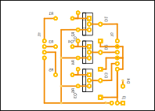

# Driver 2

This is the PCB for the three solenoids. I decided to put the solenoid driver on a separate pcb, apart from the shields. In this way, the 12V power could be separated from the arduino.

A ground and 11.3V header is available, to power the ardunio from this shield (the header is after the protection diode, so the actual voltage is not 12V, but a diode drop lower).

