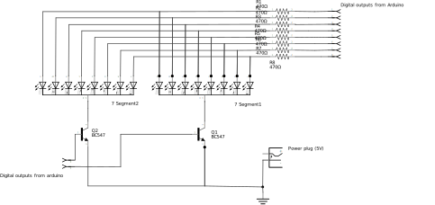

# Dual digit 7-segment driver

This circuit is used as a multiplex driver circuit for two 7-segment digits (or actually 8 segment if you also count the dot).

It uses 10 digital out pins of an arduino: 8 pins are used to drive each segment of the segment-LED and the other 2 pins are used to switch the BC547 transistor (the LED is a common cathode version, so you need a NPN transistor).

The 470K resistors are a bit large and will result in a not-so-bright LED display. A resistor per segment is needed, otherwise the LED display will have different brightness when different number of LED's are lighted.

The breadboard version is a bit chaotic, due to the large number of connections between the two digits.

|Part|Description|
|----|-----------|
| Q1,Q2 | BC547 NPN BJT transistor |
| R1..R8 | 470K resistor |

Inspiration:
- http://embedded-lab.com/blog/lab-11-multiplexing-seven-segment-led-displays/
- https://www.youtube.com/watch?v=7YAlIOX6Qto
- http://www.circuitbasics.com/arduino-7-segment-display-tutorial/
