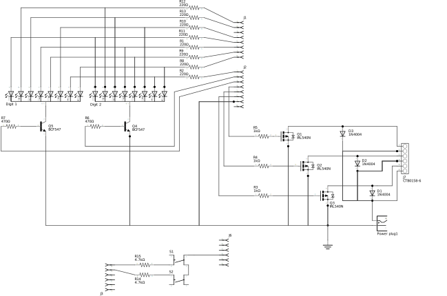
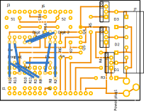
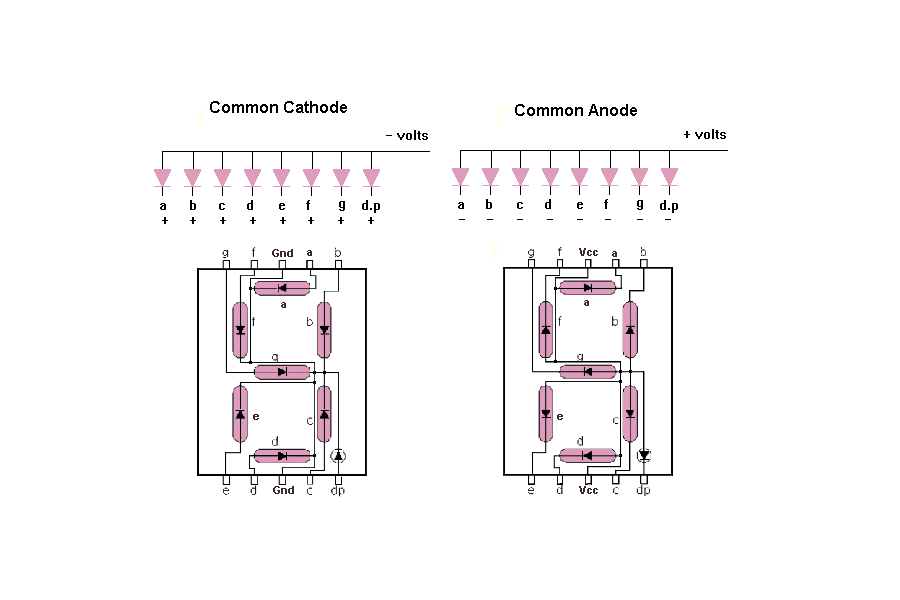

# Shield-2

Shield-2 contains the buttons, digits and solenoid driver. It is actually a combination of the segment-driver and solenoid-driver. A separate circuit contains two buttons that are read by the analog input pins A4 and A6 (used as digital ins).

The circuit has a common ground and two voltage sources: the 5V voltage source from the arduino UNO and a separate 12V voltage source to drive the solenoids.

The PCB below is created for a perfboard solution, so all wiring is done on one side of the PCB, all components are on the other side. Some jumper wires are used to fix wiring problems. The PCB uses a 50mm x 70mm screen (24x18 raster). The headers correspond with the headers of a protoshield that is used as "shield-1". They contain all the normal Arduino UNO headers (digital In/outs, analog Ins, 5V, GND, etc).

The Vin pin of the arduino is not used to power the 12V solenoids. We could provide 12V to the arduino jack and use the Vin pin as 12V source (actually probably 11.3V because of the voltage drop of the protecting diode). But this would mean that the coper tracing in the arduino uno would carry all the current for the solenoids. A "better" solution (but, again, probably overkill) would be to have the current supply for the solenoid separated from the Arduino board. This is done by having a separate 12V input. We included a protecting diode in the circuit, so inavertilly using the wrong jack will not fry the circuit.

The mapping of the pins of the segments to the arduino pins is done purely for the optimalization of the layout of the PCB. This means that some tinkering needs to be done to the arduino code for displaying the digits.

The actual layout of the LED pins are displayed in the figure below:

|Arduino Pin|Digit Pin|Segment|
|-----------|---------|-------|
| 0 | 10 | G |
| 1 | 9 | F |
| 3 | 4 | C |
| 4 | 5 | dp |
| 5 | 1 | E |
| 6 | 2 | D |
| 7 | 7 | A |
| 8 | 6 | B |

Arduino pin 2 is not used. Pins 3 and 8 of the digit are ground pins (common cathode).

The table below gives the representation for all numbers:

|Number|ABCDEFG|01345678|
|------|-------|--------|
| 0    |1111110|01101111|
| 1    |0110000|00100001|
| 2    |1101101|10001111|
| 3    |1111001|10100111|
| 4    |0110011|11100001|
| 5    |1011011|11100110|
| 6    |1011111|11111110|
| 7    |1110000|00100011|
| 8    |1111111|11101111|
| 9    |1111011|11100111|

Inspiration:

- https://www.youtube.com/watch?v=_ypW45Y8VSs
- https://www.open-electronics.org/the-power-of-arduino-this-unknown/
