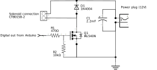
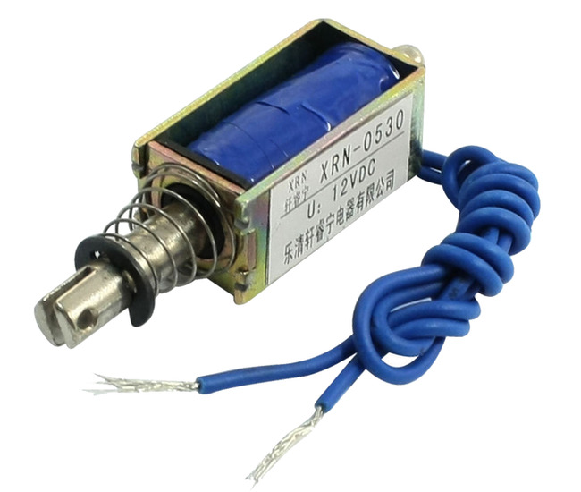
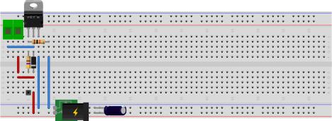

# Simple solenoid driver

This version of the solenoid driver is pretty simple. It uses a IRL540N mosfet for handling the large amount of current for the solenoid (probably a bit overkill in this situation). A 2.2mF (= 2200uF) capacitor is used the give the voltage source some buffer. 2200uF is actually not enough for one push of the solenoid (tested at 12V), but enough to give the voltage source some support without effecting the other parts of the circuit.

In the final circuit, the capacitator is left out, because the 12V power source that was actually used for this project included a pretty large buffer itself (for more than 5 strokes of the solenoid it seems!).

A more elaborate version would include a resistor and a capacitor the handle the difference between the voltage needed to get the solenoid moving and the voltage needed to keep the solenoid in place. We don't need this, because in this case, the solenoid is used as a "hammer", so we really want the solenoid to get back to its original position as fast as possible. This is achieved by setting the digital out pin of the arduino high for just enough time.

The diode is needed to protect the circuit, because the solenoid will produce current as it goes back to its original position.

The 470 ohm resistor is used as a current protection to the arduino digital out pin. The restance of the arduino pin is around 20 ohm, charging or discharging the mosfet can give a peak current of 200mA, the maximum allowed is 40mA. With a total gate charge of 40nC, the pulse will last for about 200ns (more or less depending on the total gate charge of the particular mosfet, but it'll be in this category). This will not destroy the arduino, but isn't good in the long run. The 10K resistor is used as a pull down resistor. This is actually not necessary when the arduino is in operation mode, because the digital pins are logical level, but at startup time, the GPIO pins are not in "logic" mode yet, so they don't have a clear level (on or off). The pull down resistor ensures that the gate level is "off" at this point. The two resistors form a voltage devider, but the difference between the two resistors is more than enough for the required gate voltage of the IRL540n. If you would use a switch instead of the logic level, the pull down resistor is needed. Without the pull down resistor, the mosfet would remain in "on" mode for some time before the gate would have leaked enough current to switch mode.

The circuit is used with a 12V push-pull solenoid, XRN-0530:

|Part|Description|
|----|-----------|
| Q1 | IRL540n Logic level N-Channel MOSFET TO220 package |
| D1 | 1N4004 Power diode |
| C1 | 2200uF Electrolite capacitor |
| R1 | 470 ohm resistor |
| R2 | 10K resistor |

Inspiration:

- https://www.instructables.com/id/Controlling-solenoids-with-arduino/
- https://www.youtube.com/watch?v=nwVRMU9grSI
- https://www.youtube.com/watch?v=j2F-q6Jecdo
- https://www.youtube.com/watch?v=p2rbyMoCVoU
- https://needhamia.com/diy-glockenspiel-the-circuit/
- https://makezine.com/2010/06/02/drum-solenoid-interface-for-tactile/
- https://www.wayneandlayne.com/blog/2010/06/01/drum-solenoid-interface-for-tap-tempo-metronome/
- https://hackaday.com/2016/05/11/overthinking-solenoid-control/
- https://www.bc-robotics.com/tutorials/controlling-a-solenoid-valve-with-arduino/
- https://forum.arduino.cc/index.php?topic=140967.0
